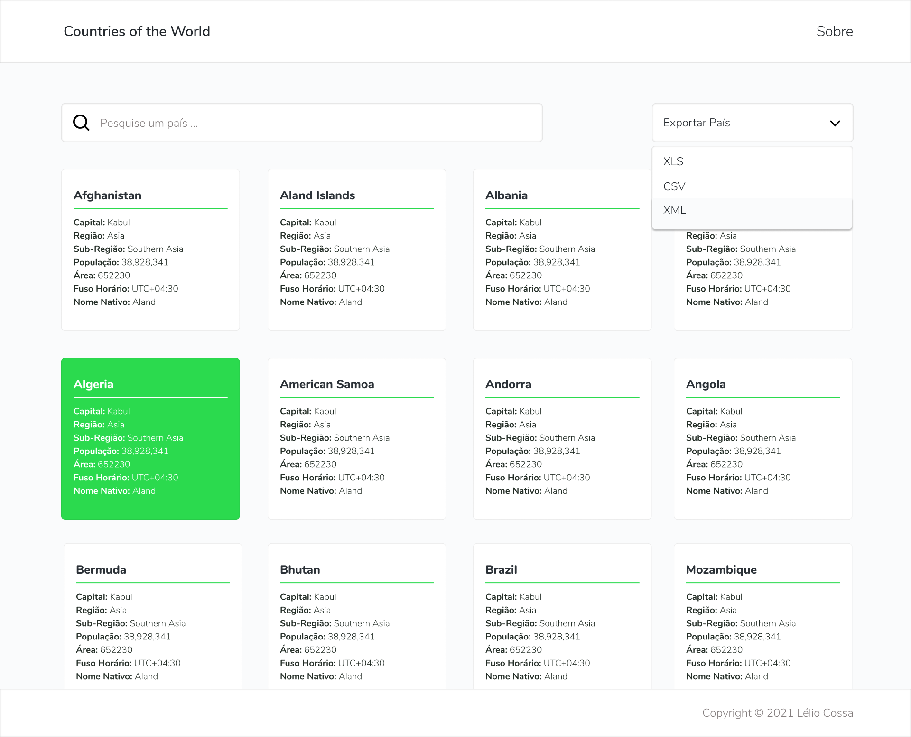

# REST Country API

## Welcome! 👋

Thanks for checking out this front-end coding challenge.

[2iBi](https://github.com/2iBi/developer-challenge) front-end challenges allow you to improve your skills in a real-life workflow.

**To do this challenge, you need a good understanding of JavaScript.**

## The challenge

Your challenge is to integrate with the [REST Countries API](https://restcountries.com) to pull country data and display it like in the designs.

Your users should be able to:

- See all countries from the API on the homepage
- Implement a mechanism within the REST client to export country information to XLS, CSV and XML format
- Click on a country to see the flag

## Material Design 🖼
- [Figma](https://bit.ly/3o4F25u)

## Live Site
https://countries.leliocossa.me/
